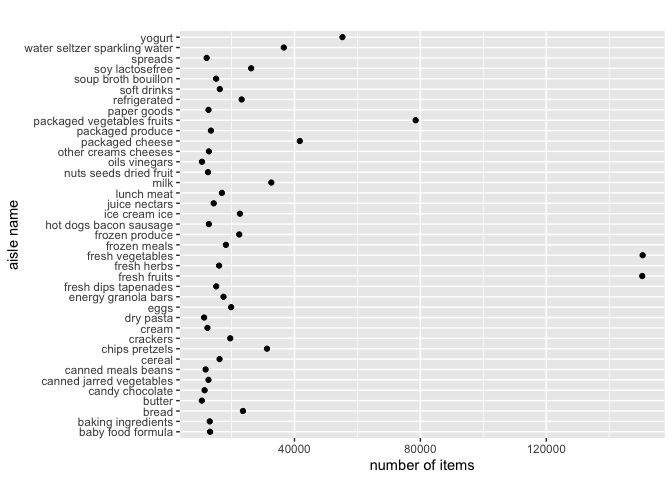

P8105 HW3
================
Yushan Wang

``` r
library(tidyverse)
```

    ## ── Attaching packages ─────────────────────────────────────── tidyverse 1.3.1 ──

    ## ✓ ggplot2 3.3.5     ✓ purrr   0.3.4
    ## ✓ tibble  3.1.4     ✓ dplyr   1.0.7
    ## ✓ tidyr   1.1.3     ✓ stringr 1.4.0
    ## ✓ readr   2.0.1     ✓ forcats 0.5.1

    ## ── Conflicts ────────────────────────────────────────── tidyverse_conflicts() ──
    ## x dplyr::filter() masks stats::filter()
    ## x dplyr::lag()    masks stats::lag()

``` r
library(p8105.datasets)
```

# Problem 1

``` r
data("instacart")
```

The “instacart” dataset has 15 columns(variables) and 1384617 rows.

The meaning of some of the key variables are listed below: (source:
<https://www.p8105.com/dataset_instacart.html>)

`add_to_cart_order: order in which each product was added to cart`

`reordered: 1 if this prodcut has been ordered by this user in the past, 0 otherwise`

`eval_set: which evaluation set this order belongs in (Note that the data for use in this class is exclusively from the “train” eval_set)`

`order_number: the order sequence number for this user (1=first, n=nth)`

`order_dow: the day of the week on which the order was placed`

`order_hour_of_day: the hour of the day on which the order was placed`

`days_since_prior_order: days since the last order, capped at 30, NA if order_number=1`

The variables `eval_set`, `product_name`, `aisle`, and `department` are
all characters. all other variables are intergers.

The distribution summary of the variables of
`add_to_cart_order`,`order_number`, `order_dow`, `order_hour_of_day`,
`days_since_prior_order` are shown below:

``` r
summary(instacart[c(3,7,8,9,10)])
```

    ##  add_to_cart_order  order_number      order_dow     order_hour_of_day
    ##  Min.   : 1.000    Min.   :  4.00   Min.   :0.000   Min.   : 0.00    
    ##  1st Qu.: 3.000    1st Qu.:  6.00   1st Qu.:1.000   1st Qu.:10.00    
    ##  Median : 7.000    Median : 11.00   Median :3.000   Median :14.00    
    ##  Mean   : 8.758    Mean   : 17.09   Mean   :2.701   Mean   :13.58    
    ##  3rd Qu.:12.000    3rd Qu.: 21.00   3rd Qu.:5.000   3rd Qu.:17.00    
    ##  Max.   :80.000    Max.   :100.00   Max.   :6.000   Max.   :23.00    
    ##  days_since_prior_order
    ##  Min.   : 0.00         
    ##  1st Qu.: 7.00         
    ##  Median :15.00         
    ##  Mean   :17.07         
    ##  3rd Qu.:30.00         
    ##  Max.   :30.00

**Count asiles and find most ordered aisles**

``` r
instacart %>%
  count(aisle, name = "n_obs") %>% 
  arrange(desc(n_obs)) 
```

    ## # A tibble: 134 × 2
    ##    aisle                          n_obs
    ##    <chr>                          <int>
    ##  1 fresh vegetables              150609
    ##  2 fresh fruits                  150473
    ##  3 packaged vegetables fruits     78493
    ##  4 yogurt                         55240
    ##  5 packaged cheese                41699
    ##  6 water seltzer sparkling water  36617
    ##  7 milk                           32644
    ##  8 chips pretzels                 31269
    ##  9 soy lactosefree                26240
    ## 10 bread                          23635
    ## # … with 124 more rows

As shown in the counting table above, there are 134 aisles. Fresh
vegetables is the aisles that most items ordered from.

**Plot of number of items ordered in each aisle**

``` r
instacart %>%
  count(aisle, name = "n_obs") %>% 
  filter(n_obs > 10000) %>% 
  ggplot(aes(x = aisle, y = n_obs))+
  geom_point() +
  coord_flip() +
  ggtitle("") +
  xlab("aisle name") + ylab("number of items")
```

<!-- -->

**Table showing the three most popular items in each of the aisles
“baking ingredients”, “dog food care”, and “packaged vegetables
fruits”**

``` r
baking_ingredients = 
  instacart %>%
  filter(aisle == "baking ingredients") %>% 
  group_by(aisle, product_name) %>%
  summarize(n_obs = n()) %>% 
  arrange(desc(n_obs)) 
```

    ## `summarise()` has grouped output by 'aisle'. You can override using the `.groups` argument.

``` r
dog_food_care = 
  instacart %>%
  filter(aisle == "dog food care") %>% 
  group_by(aisle, product_name) %>%
  summarize(n_obs = n()) %>% 
  arrange(desc(n_obs)) 
```

    ## `summarise()` has grouped output by 'aisle'. You can override using the `.groups` argument.

``` r
packaged_vegetables_fruits = 
  instacart %>%
  filter(aisle == "packaged vegetables fruits") %>% 
  group_by(aisle, product_name) %>%
  summarize(n_obs = n()) %>% 
  arrange(desc(n_obs)) 
```

    ## `summarise()` has grouped output by 'aisle'. You can override using the `.groups` argument.

``` r
three_most_popular = 
  bind_rows(baking_ingredients[c(1,2,3),],dog_food_care[c(1,2,3),],packaged_vegetables_fruits[c(1,2,3),])

three_most_popular
```

    ## # A tibble: 9 × 3
    ## # Groups:   aisle [3]
    ##   aisle                      product_name                                  n_obs
    ##   <chr>                      <chr>                                         <int>
    ## 1 baking ingredients         Light Brown Sugar                               499
    ## 2 baking ingredients         Pure Baking Soda                                387
    ## 3 baking ingredients         Cane Sugar                                      336
    ## 4 dog food care              Snack Sticks Chicken & Rice Recipe Dog Treats    30
    ## 5 dog food care              Organix Chicken & Brown Rice Recipe              28
    ## 6 dog food care              Small Dog Biscuits                               26
    ## 7 packaged vegetables fruits Organic Baby Spinach                           9784
    ## 8 packaged vegetables fruits Organic Raspberries                            5546
    ## 9 packaged vegetables fruits Organic Blueberries                            4966

**Table showing the mean hour of the day at which Pink Lady Apples and
Coffee Ice Cream are ordered**

Table showing the mean hour of the day at which Pink Lady Apples are
ordered

``` r
Pink_Lady_Apples = 
  instacart %>% 
  filter(product_name == "Pink Lady Apples") %>% 
  group_by(order_dow) %>% 
  summarize(mean_hour_of_the_day = mean(order_hour_of_day))

Pink_Lady_Apples
```

    ## # A tibble: 7 × 2
    ##   order_dow mean_hour_of_the_day
    ##       <int>                <dbl>
    ## 1         0                 13.4
    ## 2         1                 11.4
    ## 3         2                 11.7
    ## 4         3                 14.2
    ## 5         4                 11.6
    ## 6         5                 12.8
    ## 7         6                 11.9

Table showing the mean hour of the day at which Coffee Ice Cream are
ordered

``` r
Coffee_Ice_Cream = 
  instacart %>% 
  filter(product_name == "Coffee Ice Cream") %>% 
  group_by(order_dow) %>% 
  summarize(mean_hour_of_the_day = mean(order_hour_of_day))

Coffee_Ice_Cream
```

    ## # A tibble: 7 × 2
    ##   order_dow mean_hour_of_the_day
    ##       <int>                <dbl>
    ## 1         0                 13.8
    ## 2         1                 14.3
    ## 3         2                 15.4
    ## 4         3                 15.3
    ## 5         4                 15.2
    ## 6         5                 12.3
    ## 7         6                 13.8

Table taking the mean of the mean hour of the day in Pink Lady Apple and
Coffee Ice Cream tables

``` r
merge(x = Pink_Lady_Apples, y = Coffee_Ice_Cream, by = "order_dow") %>% 
  mutate(mean_hour_of_the_day = ((mean_hour_of_the_day.x + mean_hour_of_the_day.y)/2)) %>% 
  subset(select = -c(mean_hour_of_the_day.x, mean_hour_of_the_day.y)) 
```

    ##   order_dow mean_hour_of_the_day
    ## 1         0             13.60769
    ## 2         1             12.83789
    ## 3         2             13.54154
    ## 4         3             14.78409
    ## 5         4             13.38456
    ## 6         5             12.52374
    ## 7         6             12.88542

## Problem 2

``` r
data("BRFSS")
```

## Problem 3

Load and tidy the data

``` r
accel_df <- 
  read_csv("data/accel_data.csv") %>% 
  janitor::clean_names() %>% 
  mutate(day = factor(day))
```

    ## Rows: 35 Columns: 1443

    ## ── Column specification ────────────────────────────────────────────────────────
    ## Delimiter: ","
    ## chr    (1): day
    ## dbl (1442): week, day_id, activity.1, activity.2, activity.3, activity.4, ac...

    ## 
    ## ℹ Use `spec()` to retrieve the full column specification for this data.
    ## ℹ Specify the column types or set `show_col_types = FALSE` to quiet this message.

There are 35 observations and 1443 variables in this dataset. The
variables are `week`, `day_id`, `day`, and 1440 activity variables like
`activity_1`, `activity_2`… to `activity_1440`.
